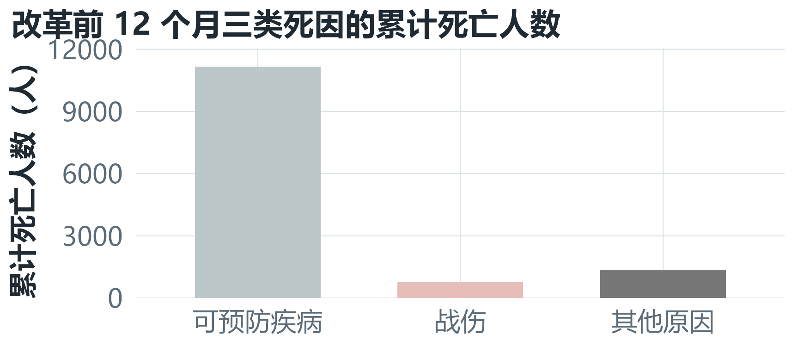
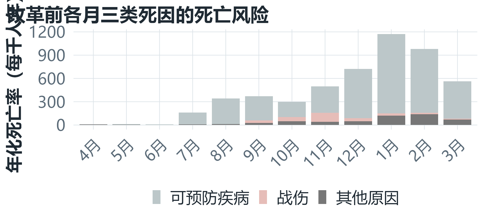
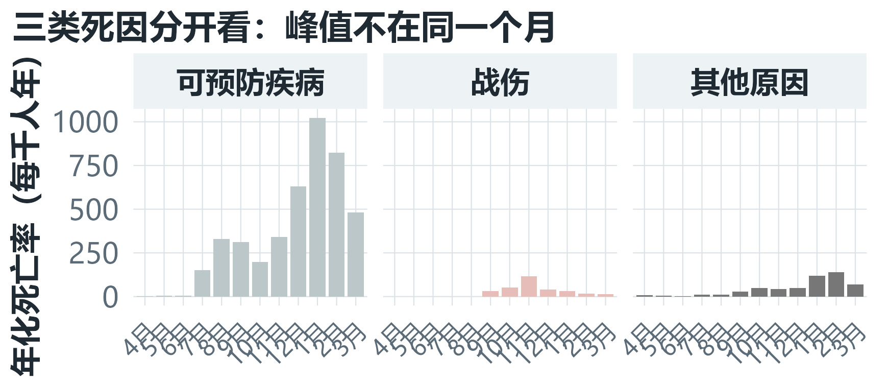
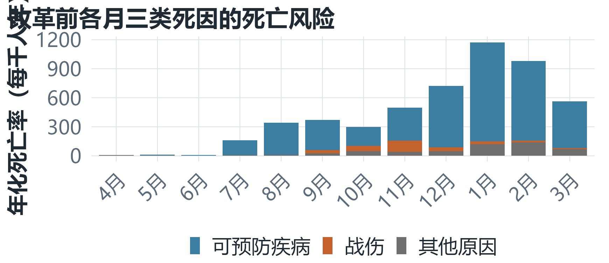
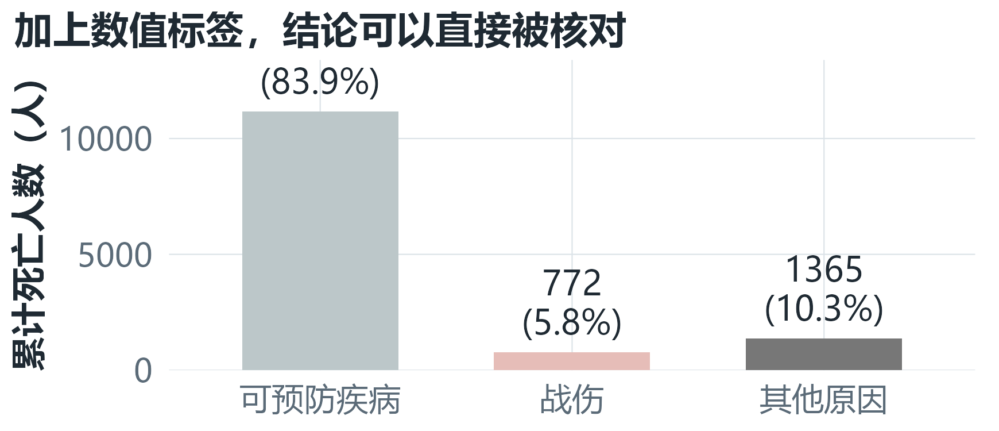
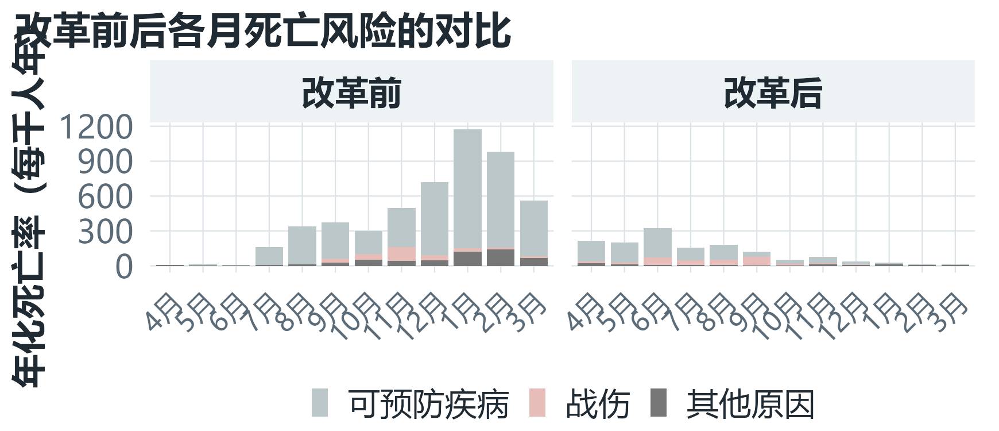
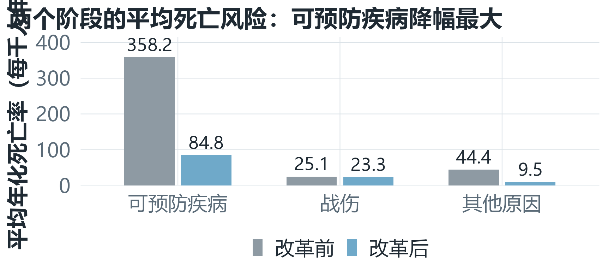

<!--
==================================================================
《R 语言与数据可视化》第 02 讲 —— 项目制课程课件（PPTX 版）
项目：克里米亚战场士兵死亡原因探究（南丁格尔玫瑰图）

说明：
1. 本课件为 2 课时（90 分钟）课堂讲授用，逻辑主线为
   项目背景 → 新知探究 → 项目任务（第一课时 / 第二课时）→ 项目总结。
2. "先想一想 / 参考答案"成对页面中的**纯文字参考答案页已省略**，
   教师可用动画在提问页上逐步揭示答案（任务结果图单独成页，便于择时展示）。
3. 版式与配色由 `ppt7_assets/reference-ppt7.pptx` 提供：
   16:9（13.333×7.5 英寸）、深色底 #101820、标题 34pt、
   正文 30/28pt、章节导航与页码由母版统一绘制。
4. 所有图形由 `ppt7_assets/make_figs.R` 预生成（与项目指导书完全同源、
   同一套配色 cause_colors），课件直接引用 PNG，保证投影清晰、渲染稳定。
5. 课件不使用 Markdown 表格：pptx 中表格文字受内置样式限制（约 18pt），
   为保证"最小字号 28pt"的要求，全部改为要点式与双栏对照呈现。
6. 图片统一使用"图注图"写法 ``：渲染为全宽大图 + 底部
   一行说明，既避免"图片后段落另起一页"产生空白页，也保证图注单行不溢出。
7. 构建方式（渲染 + 后处理，pptx 的 post-render 钩子不生效）：
      powershell -File ppt7_assets\build_ppt7.ps1
   后处理 `fix_pptx.py` 负责：代码块压到 20pt（等宽字体整段判定，
   不误伤行内代码）、引用块（> ...）改为金色 28pt 强调行。
8. 版式约束：标题 34pt、正文 30pt、二级 28pt、代码 20pt；
   已用 `audit_sizes.py` 校验全篇无低于 28pt 的正文字，并逐页检查无溢出。
==================================================================
-->

# 项目背景

## 课堂的第一个问题

**1854 年，克里米亚战争。士兵主要死于战伤，还是死于本可预防的疾病？**

- A　战伤
- B　可预防疾病
- C　其他原因
- D　需要数据，暂时无法判断

**先凭直觉投一票，然后再用数据检验。**

## 战场之外的死亡

::: columns

::: {.column width="58%"}
当时的公众认知：士兵的生命结束于战场——被子弹击中，因伤口恶化。

随军护士**弗洛伦丝·南丁格尔**抵达斯库塔里战地医院后，看到的是另一个战场：没有冲锋号，只有拥挤、污秽、疾病蔓延的病区。

她整理了 1854 年 4 月至 1856 年 3 月，共 **24 个月**的英军伤亡数据。
:::

::: {.column width="42%"}
**思考三问**

- 如果主要死因不是战伤，问题出在哪里？
- 医院与营地里，什么在杀死士兵？
- 用什么证据才能说服政府投入资源？
:::

:::

## 斯库塔里：没有枪声的战场


## 一张图，改变了一次决策

- 1855 年 3 月，英国政府派卫生委员会实施基础卫生工程：清理粪坑与污水池、冲洗下水道、清除污染水源的动物尸体、改善通风与病房拥挤
- 1858 年，南丁格尔在《影响英军健康、效率与医院管理的笔记》中发表这样一张图
- **两个并排的扇形图** = 卫生改革前后各 12 个月
- 每个月的**扇形面积** = 该月的死亡水平
- **颜色** = 三类死亡原因

> 可视化不只是把数字画出来，而是**让证据被看见**。

## 本项目的目标图形


## 你在这个项目中的角色

**你的身份：军队卫生改革数据顾问**

政府需要决定：有限的资源，应该优先用于**战伤救治**，还是用于改善**医院与营地的卫生条件**？

> 驱动性问题：数据能否为卫生改革的资源投入提供**可信证据**？

- **4 幅证据图**：分别服务于 4 个不同的分析问题
- **1 段图表解读**：按"结论—证据—建议—局限"组织
- **1 项行动建议**：面向公共卫生决策，并说明结论的边界

## 数据从哪里来


## 数据与研究对象

- **数据来源**：`HistData::Nightingale`，南丁格尔记录并整理的英军月度伤亡数据
- **时间范围**：1854 年 4 月—1856 年 3 月，共 **24 个月**
- **改革前**：1854 年 4 月—1855 年 3 月（12 个月）
- **改革后**：1855 年 4 月—1856 年 3 月（12 个月）
- **死亡原因**：可预防疾病、战伤、其他原因
- **军队人数**：当月英军平均人数的估计值，是计算死亡率的**分母**

## 为什么必须用"率"而不是"人数"

**军队人数在 24 个月里不断变化。**

- 只看死亡人数，会把"**士兵多所以死得多**"误当成"**风险高**"
- 死亡人数回答"死了多少人"——**负担**
- 年化死亡率回答"风险有多高"——**风险**

年化死亡率 = 12 × 1000 × 死亡人数 ÷ 军队人数

## 数据字典

- **日期**：观测月份，1854-04 至 1856-03
- **月份**：4 月 → 次年 3 月，已按战争时间顺序排列（分类变量）
- **军队人数**：当月英军平均人数（人）
- **阶段**：改革前 / 改革后（分类变量）
- **死亡原因**：可预防疾病 / 战伤 / 其他原因（分类变量）
- **死亡人数**：当月因该类原因死亡的人数（人）
- **死亡率**：年化死亡率（每千人年）

## 三类死因分别指什么

- **可预防疾病**：霍乱、痢疾、斑疹伤寒等与卫生条件密切相关的传染病
- **战伤**：在战斗中受伤并因此死亡
- **其他原因**：意外、其他疾病等

> **关键：假设必须建立在变量的含义上——**可以预防的疾病，理论上可以被卫生条件改变。

## 数据准备（一）读取数据

```r
library(tidyverse)
library(HistData)

nightingale <- HistData::Nightingale
head(nightingale)
```

## 数据准备（二）宽表 → 长表

原始数据是**宽表**（三类死因各占一列），绘图需要**长表**（一行 = 某月 × 某类死因）。

```r
nightingale_long <- nightingale %>%
  mutate(阶段 = factor(rep(c("改革前", "改革后"), each = 12),
                       levels = c("改革前", "改革后"))) %>%
  rename(Disease.count = Disease, Wounds.count = Wounds,
         Other.count = Other) %>%
  pivot_longer(
    cols = c(Disease.count, Wounds.count, Other.count,
             Disease.rate, Wounds.rate, Other.rate),
    names_to = c("死亡原因", ".value"), names_sep = "\\."
  )
```

## 数据准备：整理列名与派生数据框

```r
nightingale_long <- nightingale_long %>%
  rename(日期 = Date, 年份 = Year, 军队人数 = Army,
         死亡人数 = count, 死亡率 = rate) %>%
  mutate(
    月份 = factor(as.integer(format(日期, "%m")),
                  levels = c(4:12, 1:3),
                  labels = paste0(c(4:12, 1:3), "月")),
    死亡原因 = factor(recode(死亡原因, "Disease" = "可预防疾病",
                             "Wounds" = "战伤", "Other" = "其他原因"),
                      levels = c("可预防疾病", "战伤", "其他原因"))
  )

before <- nightingale_long %>% filter(阶段 == "改革前")
after  <- nightingale_long %>% filter(阶段 == "改革后")
```

## 项目目标

完成本项目后，我能够：

- 从真实问题中提取**分析目的**，并确定需要比较的变量与指标
- 建立「**变量 → 视觉通道**」的映射关系，独立完成证据图
- 用 `ggplot()`、`aes()`、`geom_col()`、`labs()`、`facet_wrap()`、`coord_polar()`、`scale_y_sqrt()` 组合出所需图形
- 区分「**变量映射**」与「**属性设定**」
- 按「**结论—证据—建议—局限**」解读图表，并说明结论的边界
- 在 AI 辅助环境中保持对数据、代码和结论的**主体判断**

## 可视化全流程地图

这条链是本项目的主线：

- **真实问题** → ① 明确分析目的 → ② 选择指标 → ③ 建立映射
- ④ 构建图形 → ⑤ 解读证据 → ⑥ 形成建议

**先想一想：①④⑥ 三个空该填什么？**

备选环节：认识数据 / 明确分析目的 / 构建图形 / 形成建议

## 每个环节要回答什么

- **① 明确分析目的**：要回答什么问题？→ 驱动性问题
- **② 选择指标**：用什么数据回答？→ 人数 / 年化死亡率
- **③ 建立映射**：变量映射到哪？→ 映射表
- **④ 构建图形**：用什么图层画？→ ggplot2 代码
- **⑤ 解读证据**：证据在哪里？→ 图表解读
- **⑥ 形成建议**：话能说到什么程度？→ 决策建议与局限

> 如果在 ⑤ 发现图形答不出问题，就要回到 ②③④ 修改，而不是继续往下做。

## 四个任务构成完整问题链

- **任务 1**：哪一类死亡原因造成的死亡**负担**最重？→ 累计死亡人数对比图
- **任务 2**：高死亡水平是否**集中在个别月份**？→ 月度堆叠柱形图
- **巩固提升**：三类死因的月度变化是否一致？怎样改进表达？
- **任务 3**：卫生改革前后**发生了什么变化**？→ 按阶段分面对比图
- **任务 4**：玫瑰图适合**分析**还是**传播**？→ 玫瑰图与图形取舍评价
- **项目结论**：证据支持怎样的**行动建议**？

## 两课时安排

**第一课时**　任务 1 · 任务 2 · 巩固提升

- 新知支撑：视觉通道、图形映射、ggplot2 基础语法、统一配色

**第二课时**　任务 3 · 任务 4

- 新知支撑：分面、极坐标与面积编码、图形选择与评价

实践路线：**分析目的 → 数据映射 → 图形建构 → 图表解读**

分层要求：★ 基础必做　★★ 进阶选做　★★★ 挑战合作

# 新知探究

## 视觉通道：把数据送进眼睛

数据变量必须通过**视觉通道**才能进入图形。

- **位置**：最精确，可读出高低、左右 → 月份、累计死亡人数
- **长度**：很精确，可直接比较长短 → 柱形高度、年化死亡率
- **角度 / 面积**：较粗略，容易被夸大 → 玫瑰图中的扇形
- **颜色（色相）**：擅长区分**类别**，不擅长比较大小 → 死亡原因
- **分面**：把整体拆成结构相同的小图 → 改革前 / 改革后

**先想一想：要精确比较三类死因的死亡水平，应该优先使用哪两个通道？**

## 视觉通道：怎么选

- 要**精确比较**，用「**位置**」和「**长度**」：柱高与数值成线性关系，可直接读出高低和差值
- **角度、面积**与半径是平方关系，读者容易把差异看成数值的倍数
- **颜色**擅长回答"是哪一个"，不擅长回答"大多少"——让颜色只管分类

> 一句话原则：**要精确比较，用位置和长度；要用颜色，就让颜色只管分类。**

本项目图形分工：柱形图看负担、堆叠柱形图看月份、分面图看阶段、玫瑰图让公众一眼看懂。

## ggplot2 图形语法：完整框架

ggplot2 用"**数据 + 映射 + 图层**"逐步建构图形。

```r
ggplot(data = 数据框,
       aes(x = 横轴变量,
           y = 纵轴变量,
           fill = 分类变量)) +
  geom_几何对象() +       # 柱、点、线等
  stat_统计变换() +       # 计数、汇总等（可选）
  scale_标度() +          # 颜色、坐标刻度等
  facet_分面() +          # 分组比较
  coord_坐标系() +        # 直角或极坐标
  labs(...) +             # 标题、轴名、图例名
  theme_主题()             # 非数据元素
```

**核心骨架：**`ggplot(data, aes(...)) + geom_*()`

## ggplot2 图层的职责

- **data**：使用哪份数据？→ `ggplot(data = ...)`
- **mapping**：变量映射到哪里？→ `aes(x, y, fill)`
- **geom**：用什么图形表达？→ `geom_col()`
- **scale**：颜色和刻度怎样显示？→ `scale_fill_manual()`
- **facet**：怎样分组比较？→ `facet_wrap()`
- **coord**：使用什么坐标系统？→ `coord_polar()`
- **labs**：标题、轴名、图例名
- **theme**：非数据元素怎样显示？→ `theme_minimal()`

> `ggplot() + geom_*()` 决定"**画什么**"；`scale_*()`、`facet_*()`、`coord_*()` 决定"**怎样显示**"。

## 变量映射 vs 属性设定

::: columns

::: {.column width="50%"}
**映射：写在 `aes()` 内**

```r
ggplot(before,
       aes(x = 月份,
           y = 死亡率,
           fill = 死亡原因)) +
  geom_col()
```

颜色随死亡原因变化，并自动生成图例。
:::

::: {.column width="50%"}
**属性设定：写在 `aes()` 外**

```r
ggplot(before,
       aes(x = 月份,
           y = 死亡率)) +
  geom_col(fill = "steelblue")
```

所有柱子同一种颜色，不会生成图例。
:::

:::

## 变量映射 vs 属性设定：判断题

**先想一想：**

- `geom_col(fill = "steelblue")` 会让三类死因变成几种颜色？
- `aes(fill = 死亡原因)` 中的颜色由什么决定？
- 如果任务 4 的玫瑰图漏掉了 `fill = 死亡原因`，会发生什么？

> 提示：请分别说出"颜色由谁决定"，再判断它会不会生成图例。

## `geom_col()` 还是 `geom_bar()`

- **`geom_bar()`**：自动统计每类有多少行 → 回答"每个类别**出现多少次**"
- **`geom_col()`**：直接使用已有的 y 变量 → 回答"每类**已有数值是多少**"

本项目已经拥有 `累计死亡人数` 和 `死亡率`，因此全部使用 `geom_col()`：

```r
ggplot(cause_summary,
       aes(x = 死亡原因, y = 累计死亡人数, fill = 死亡原因)) +
  geom_col()          # 数据里已经有 y 值，直接用 geom_col()
```

> 一句话记忆：**有数值就用 col，数条数才用 bar。**

## 统一配色：`scale_fill_manual()`

本项目**全项目只用一套颜色**，定义在数据准备代码里，之后任何地方都不再改动：

- **可预防疾病** = `#BCC7C9`（灰蓝）
- **战伤** = `#E6BDB8`（灰粉）
- **其他原因** = `#777777`（深灰）

```r
cause_colors <- c("可预防疾病" = "#BCC7C9", "战伤" = "#E6BDB8",
                  "其他原因" = "#777777")

ggplot(cause_summary, aes(x = 死亡原因, y = 累计死亡人数, fill = 死亡原因)) +
  geom_col() +
  scale_fill_manual(values = cause_colors)   # 套用统一配色
```

## 表达红线：不要覆盖 `cause_colors`

要**自选**颜色时（例如巩固提升的进阶任务），请另起一个变量名：

```r
my_colors <- c("可预防疾病" = "#3B7EA1", "战伤" = "#C4622D", "其他原因" = "#6E6E6E")
```

一旦覆盖 `cause_colors`，后面任务的配色会跟着变，**"同一类死因在所有图里颜色相同"就断了**。

配色是**属性层**的决策，不能污染**映射层**的约定。

## 分面：`facet_wrap()`

分面把一张图拆成**结构相同**的多个小图，让小图之间可以直接比较。

```r
ggplot(nightingale_long, aes(x = 月份, y = 死亡率, fill = 死亡原因)) +
  geom_col() +
  facet_wrap(~ 阶段, ncol = 2)      # 按阶段拆成两张小图
```

分面能成立的三个条件：

- **纵轴尺度**必须一致（`scales = "fixed"`，默认值）
- **月份顺序**两个阶段都用 4 月 → 次年 3 月
- **颜色含义**两个面板都用 `cause_colors`

> 分面 = 同样的图形结构 + 同样的尺度 + 不同的分组。少了任何一条，比较就不成立。

## 极坐标与面积编码

玫瑰图 = 柱形图 + **极坐标** + **平方根尺度**。

等角扇形的面积满足 **A = ½·θ·r²**。要让**面积**与死亡率成正比，半径必须按死亡率的**平方根**缩放：

```r
p4_rose <- p4_base +
  scale_y_sqrt() +     # 半径 = √数值，使面积对应数值
  coord_polar()        # 直角坐标 → 极坐标
```

又因为三类死因是**叠加**画的，第 k 类死因所占扇环的面积为

**A(k) = ½·θ·( r(k)² − r(k−1)² ) = ½·θ·d(k)**　（θ = 每月所占角度，d(k) = 第 k 类死因当月死亡率）

## 极坐标：三个问题

**先想一想：**

- 柱形图用什么表达数值？玫瑰图用什么表达数值？
- 如果把半径的倍数直接当成死亡率的倍数，会犯什么错？
- 既然面积编码这么绕，为什么南丁格尔还要用它？

> 参考数据（1855 年 1 月）：可预防疾病 1022.8、战伤 30.7、其他原因 120.0

**结论：每一类死因扇环的面积，恰好与它自己的死亡率成正比。**

## 三个容易混淆的概念

- **变量映射**：颜色 / 位置由**数据变量**决定 → `aes(fill = 死亡原因)`
- **属性设定**：颜色 / 大小由**你指定**，与数据无关 → `geom_col(fill = "steelblue")`
- **指标**：用什么数字回答问题 → 累计死亡人数（负担）／年化死亡率（风险）

> 三者中只有**变量映射**会自动生成图例。

## 代码解释关卡（两人一组）

- `data` 指定了什么？`aes()` 建立了哪些映射？
- `geom_col()` 为什么适合本任务？
- 如果把 `fill = 死亡原因` 移到 `aes()` 外，会发生什么？

> 通过标准：不看讲义，用自己的语言说明每一行代码。

# 项目任务

## 第一课时：任务 1、任务 2、巩固提升

- **任务 1**　认识数据、选指标：哪一类死亡原因造成的死亡**负担**最重？→ 累计死亡人数对比图
- **任务 2**　换月度视角：高死亡水平是否**集中在个别月份**？→ 月度堆叠柱形图
- **巩固提升**　三星分层：三类死因的月度变化是否一致？怎样改进表达？

第一课时的重点：完成"**分类比较**"与"**月份变化**"两个层次的证据构建。

## 任务 1：哪类死因的负担最重

**先想一想**

**卫生改革前这 12 个月里，三类死因各自累计死亡多少人，谁的死亡负担最重？**

- 我要比较的是：__________
- 我要比较的变量是：__________
- 我的预测：负担最重的是 __________，理由是 __________

决策问题：比较对象（三类死因）· 比较指标（**累计死亡人数**）· 使用数据（`before`）· 图形受众（没有统计基础的政府官员）

## 任务 1：变量如何进入图形

**把每个数据变量放到它应该去的视觉通道上。**

- **死亡原因** → 横轴位置 → `x = ______`
- **累计死亡人数** → 柱形高度 → `y = ______`
- **死亡原因** → 填充颜色 → `fill = ______`

> 选 `geom_col()` 的理由：数据里已经有 `累计死亡人数`，柱形高度**直接使用**该数值。

同一个变量可以同时映射到多个通道：颜色并不提供额外信息，只是让三类死因更容易区分，所以本图可以隐藏图例。

## 任务 1：图形建构（一）先汇总数据

```r
cause_summary <- before %>%
  group_by(死亡原因) %>%
  summarise(累计死亡人数 = sum(死亡人数),
            平均死亡率 = mean(死亡率), .groups = "drop") %>%
  mutate(占比 = 100 * 累计死亡人数 / sum(累计死亡人数))

cause_summary
```

## 任务 1：图形建构（二）再补全画图

```r
p1 <- ggplot(
  data = cause_summary,
  aes(x = ____, y = ____, fill = ____)
) +
  geom_col(width = 0.7) +
  scale_fill_manual(values = cause_colors) +
  labs(
    title = "____________________________________",
    subtitle = "1854 年 4 月—1855 年 3 月，共 12 个月",
    x = NULL, y = "____________________", fill = "死亡原因"
  )
p1
```

## 任务 1 结果：累计死亡人数对比图



## 任务 1：图表解读

**先想一想：用证据回答问题**

- **结论**：死亡负担最重的是 __________
- **证据**：累计死亡 ________ 人，占全部死亡的 ________%
- **局限**：该图只反映 12 个月的合计，不能说明 __________

读图时按三个问题依次回答：

1. 谁最高？
2. 高多少？（给出数值与占比）
3. 这张图还不能说明什么？

## 任务 2：高风险是否集中在个别月份

**先想一想**

**改革前这 12 个月里，哪些月份的死亡水平较高？它们是否相邻？主要由哪类死因贡献？**

- 本任务观察的时间单位是 __________，使用的指标是 __________
- 我判断"高值是否集中"的依据是：__________
- 我的预测：最高的月份是 ________，它应该在 ________ 季

**关键决策：**任务 1 用"人数"看负担，任务 2 必须换成"**年化死亡率**"看风险。

## 任务 2：月份、死亡率与死因

- **月份先后** → 横轴位置 → `x = 月份`
- **某月某类死因的死亡水平** → 柱形高度 → `y = 死亡率`
- **不同死因的贡献** → 填充颜色 → `fill = 死亡原因`

使用**堆叠柱形图**（`geom_col()` 的默认位置）：

- 柱子的总高度 = 当月三类死因合计的年化死亡率
- 每种颜色 = 一类死因的贡献
- 读图顺序：**先看总高度，再看颜色构成**

> 同一个月里，三类死因共享**同一个军队人数**作分母，所以它们的年化死亡率可以叠加。

## 任务 2：图形建构（一）画出堆叠柱形图

```r
p2 <- ggplot(
  data = ____,                       # 提示：使用改革前的数据
  aes(x = ____, y = ____, fill = ____)
) +
  geom_col() +
  scale_fill_manual(values = cause_colors) +
  labs(
    title = "____________________________",
    subtitle = "改革前：1854 年 4 月—1855 年 3 月",
    x = NULL, y = "____________________", fill = "死亡原因"
  )
p2
```

## 任务 2：图形建构（二）找出最高的 3 个月

```r
n_high <- before %>%
  group_by(日期, 月份) %>%
  summarise(月合计死亡率 = sum(死亡率), .groups = "drop") %>%
  slice_max(order_by = ____, n = 3, with_ties = FALSE) %>%
  arrange(日期)

n_high
```

## 任务 2 结果：月度堆叠柱形图



## 任务 2：最高的 3 个月

- 第 1 高：**1855 年 1 月**，月合计年化死亡率 **1173.5**
- 第 2 高：**1855 年 2 月**，月合计年化死亡率 **979.2**
- 第 3 高：**1854 年 12 月**，月合计年化死亡率 **721.2**
- 最低：1854 年 6 月，仅 **7.2**——与最高月相差约 **1166.3**

三个高值月份是**连续的冬季月**（1854 年 12 月—1855 年 2 月）。

## 任务 2：图表解读

**先想一想：证据接力**——每组说一句话，后一组必须引用前一组的证据。

1. **描述**：最高的月份是 ________
2. **比较**：它明显高于 ____________
3. **构成**：高值主要由 ________ 死亡构成
4. **边界**：图中还不能说明 ________________

**分层任务：**★ 找出最高月份与主因　｜　★★ 比较"人数图"与"死亡率图"　｜　★★★ 说明**不同月份**为何可直接比较

## 巩固提升：三星分层任务

基础任务必做，进阶与挑战任务按自己的学习情况选做。所有图形继续使用**统一配色** `cause_colors`。

- ★ **基础**：三类死因的月度变化是否一致？**分开**呈现 → `facet_wrap()`
- ★★ **进阶**：为上一张图**自选三种填充颜色** → `scale_fill_manual()`
- ★★★ **挑战**：为任务 1 的图加上**数值标签** → `geom_text()` + `expand`

> 自选颜色请**另起变量名**（如 `my_colors`），不要覆盖 `cause_colors`——任务 3、任务 4 还要用它做跨图对照。

## 巩固提升 ★ 结果：三类死因分开看



## 巩固提升 ★★ 结果：配色只改变外观



## 巩固提升 ★★★ 结果：加上数值标签



## 第一课时小结

- **哪类死因的负担最重？**→ 可预防疾病 **11157** 人，占 **83.93%**
- **高死亡是否集中在个别月份？**→ 集中在 1854-12—1855-02 三个连续冬季月
- **三类死因的变化是否一致？**→ 峰值不在同一个月，必须**分开看**

**仍待解决：**卫生条件改善后，死亡模式是否发生变化？

带着假设进入第二课时：可预防疾病的死亡水平将 __________。

## 第二课时：任务 3、任务 4

- **任务 3**　加入阶段维度：卫生改革前后**发生了什么变化**？→ 按阶段分面对比图
- **任务 4**　换一种坐标：玫瑰图适合**分析**还是**传播**？→ 玫瑰图与图形取舍评价
- **项目总结**　汇总证据：证据支持怎样的**行动建议**？

第二课时的重点：**比较阶段差异**，并**评价不同图形的表达价值**。

## 任务 3：改革前后发生了什么变化

**先想一想**

**两个阶段的月度死亡水平与死因构成有什么差异？同一种死因的平均水平变化了多少？**

- 我的假设是：卫生改革后，________ 造成的死亡会 ________，因为 ________
- 我预计**变化最小**的是 ________，理由是 ________

决策问题：比较对象（改革前 12 个月 vs 改革后 12 个月）· 核心指标（年化死亡率）· 比较方法（**分面**）· 使用数据（`nightingale_long`）

## 任务 3：增加阶段映射

任务 2 的三个映射保持不变，再增加一个**分面**维度：

- **月份** → 横轴位置 → `x = 月份`
- **死亡率** → 柱形高度 → `y = 死亡率`
- **死亡原因** → 填充颜色 → `fill = 死亡原因`
- **阶段** → 拆成左右两个小图对比 → `facet_wrap(~ 阶段)`

分面能成立的前提：两个面板必须保持**相同的纵轴尺度**、**相同的月份顺序**、**相同的颜色含义**。

> 只要有一条不同，读者看到的就是两张"各自为政"的图，比较就不成立。

## 任务 3：分面对比图（一）补全分面图

```r
p3 <- ggplot(
  data = ____,                        # 提示：使用全部长表
  aes(x = ____, y = ____, fill = ____)
) +
  geom_col() +
  facet_wrap(~ ____, ncol = 2, scales = "fixed") +
  scale_fill_manual(values = cause_colors) +
  labs(
    title = "____________________________________",
    subtitle = "两个阶段均按 4 月至次年 3 月排列，纵轴尺度一致",
    x = NULL, y = "____________________", fill = "死亡原因"
  )
p3
```

## 任务 3：分面对比图（二）量化阶段差异

```r
stage_summary <- nightingale_long %>%
  group_by(阶段, 死亡原因) %>%
  summarise(平均死亡率 = mean(____), .groups = "drop") %>%
  pivot_wider(names_from = 阶段, values_from = 平均死亡率) %>%
  mutate(变化幅度 = (改革后 - 改革前) / 改革前 * 100)

stage_summary
```

## 任务 3 结果：分面对比图



## 任务 3 结果：两个阶段的平均死亡风险



## 任务 3：图表解读

**先想一想：从图中提取证据**

- **结论**：改革主要影响的是 ________，而不是 ________
- **证据 1**：可预防疾病平均年化死亡率由 ________ 降到 ________（每千人年）
- **证据 2**：战伤由 ________ 变为 ________，基本 ________
- **局限**：两阶段差异还可能受到 ________________ 的影响

**观察顺序：**① 比整体柱高 → ② 找变化最大的颜色 → ③ 查其他死因是否**同步**下降

## 任务 3：寻找反证

::: columns

::: {.column width="50%"}
**支持"改革有效"的证据**

- 哪类死亡下降最明显？降幅多少？
- 两个阶段的总体水平怎样变化？
- 改革前后时间是否相邻、可比？
:::

::: {.column width="50%"}
**"仍需谨慎"的证据**

- 数据还缺少哪些影响因素？
- 季节变化、作战强度是否可能影响结果？
- 能否区分每一项卫生措施各自的作用？

> **汇报要求：**观点必须指向图中的**具体位置**或**具体数据变量**。
:::

:::

## 任务 4：玫瑰图适合分析还是传播

**先想一想**

**面向"精确分析"与面向"公众展示"两种目的，柱形图与玫瑰图各有什么优势和限制？**

- 面向**分析人员**，我需要图形帮我比较 ________________
- 面向**普通公众**，我需要图形帮读者感受 ________________
- 我的预判：分析报告用 ________，公众展示用 ________

本任务使用与任务 3 **完全相同**的数据、指标与数值范围——
**不是找"最好看的图"，而是判断"哪幅图更适合当前目的"。**

## 任务 4：坐标系改变，映射保持

- **月份**：柱形图是横轴位置 → 玫瑰图是**圆周角度**（一个圆 = 12 个月）
- **死亡率**：柱形图是**柱形高度** → 玫瑰图是**扇形面积**（半径按平方根缩放）
- **死亡原因**：两张图都用 `fill = 死亡原因`
- **阶段**：分面为左右两个小图 → **两个极坐标圆并排**
- **`cause_colors`**：让同一死因在两张图中颜色一致，保持可对照

> **不要漏掉 `fill`：**如果玫瑰图漏掉 `aes(fill = 死亡原因)`，所有扇形同色，看不出每个月的高死亡水平由哪类原因贡献。

## 任务 4：玫瑰图（一）先建柱形底图

```r
p4_base <- ggplot(
  data = nightingale_long,
  aes(x = 月份, y = 死亡率, fill = 死亡原因)
) +
  geom_col(width = 1, colour = "white") +
  scale_fill_manual(values = cause_colors) +
  facet_wrap(~ 阶段, ncol = 2, scales = "fixed") +
  labs(x = NULL, y = "年化死亡率（每千人年）",
       title = "改革前后各月三类死因的死亡风险（柱形表达）")
```

## 任务 4：玫瑰图（二）换成极坐标

```r
p4_rose <- p4_base +
  ____() +      # 填入纵轴尺度函数：使扇形面积对应死亡率
  ____() +      # 填入极坐标函数：保留月份作为角度方向
  labs(
    title = "复刻经典：南丁格尔玫瑰图（改革前后各月三类死因）",
    subtitle = "扇形面积表示月死亡率，颜色表示死亡原因",
    y = NULL
  )
p4_rose
```

## 任务 4 结果：复刻经典玫瑰图


## 任务 4：分析图与传播图

::: columns

::: {.column width="50%"}
**分析报告：优先用柱形图**

- 精确比较数值与差值：**强**（柱高与数值线性对应）
- 观察月份顺序与阶段差异：**强**（横轴按月份排列）
- 判断哪类死因贡献最大：中（堆叠段不在同一基线）
- 误读风险：**低**
:::

::: {.column width="50%"}
**公众展示：可考虑玫瑰图**

- 精确比较数值与差值：**弱**（隔了平方根换算）
- 观察月份顺序与阶段差异：中
- 判断哪类死因贡献最大：**强**
- 误读风险：**高**

> 读图必须说明：**扇形面积**表示死亡率，单位为**每千人年**。
:::

:::

## 任务 4：图形选择辩论

::: columns

::: {.column width="50%"}
**A 组：分面柱形图**

观点：政府分析报告应优先使用柱形图。

请从**精确比较、坐标尺度、误读风险**三个方面提出证据。
:::

::: {.column width="50%"}
**B 组：玫瑰图**

观点：面向公众传播时可以优先使用玫瑰图。

请从**整体感知、注意力、历史语境**三个方面提出证据。

> **共同底线：**标题、单位、图例和结论边界必须完整。
:::

:::

# 项目总结

## 四个问题形成一条证据链

- **任务 1**：哪类死因的负担最重？→ 确定主要矛盾
- **任务 2**：高死亡集中在哪些月份？→ 识别时间模式
- **巩固提升**：三类死因的变化是否一致？→ 分开看各自的节奏
- **任务 3**：改革前后怎样变化？→ 比较阶段差异
- **任务 4**：玫瑰图适合什么目的？→ 评价图形选择

> 项目结论来自多幅图的相互支持，而不是一幅"好看的图"。

## 决策建议与结论边界

**先想一想：把证据组织成一段结论**

- **结论**：改革前 ________ 是死亡主因；改革后 ________
- **建议**：有限资源应优先用于 ________，同时保留战伤救治
- **证据**：任务 1、2、3 分别从 ________、________、________ 提供支持
- **局限**：数据未记录 ________，不能把全部变化简单归因于卫生改革

> 科学表达 = **说清证据支持什么** + **说清证据不能证明什么**。

## 可视化问题求解流程

1. 从公共卫生决策中提出真实问题
2. 认识数据并选择可比较的**指标**
3. 建立**变量 → 视觉通道**的映射
4. 用 ggplot2 图层**构建图形**
5. 从图中提取**证据**并检验自己的预测
6. 比较不同**图形**的表达价值
7. 形成**建议**，同时说明局限

> ggplot2 提供绘图规则，**分析目的决定使用哪些规则**。

## AI 协同学习边界

::: columns

::: {.column width="50%"}
**AI 可以帮你**

- 解释报错和函数参数
- 比较两段代码的差异
- 提出标签、配色和布局建议
:::

::: {.column width="50%"}
**必须由你完成**

- 明确分析目的、选择指标
- 设计变量与视觉通道的映射
- 解释关键代码
- 核验图形与结论是否一致

> **AI 使用原则：**使用 AI 本身**不加分**，**能否核验**才加分。
:::

:::

## 项目评价

- **问题与分析目的**（15%）：每个任务的分析设计
- **指标与数据映射**（20%）：变量—视觉通道映射表
- **代码与图形表达**（25%）：可运行代码、标题、单位和图例
- **证据与结论**（25%）：图表解读、建议与局限
- **协作、反思与责任**（15%）：互动记录、AI 核验日志

**提交物：**`.qmd` 源文件、渲染后的 HTML、项目指导书（空白版 + 内容版）和 AI 使用记录。

## 迁移任务：宁波舟山港


## 迁移任务：五步走

> 宁波舟山港不同货物类型的吞吐量有何差异？近年来货运结构发生了怎样的变化？

**迁移要求（顺序不能颠倒）**

1. 写清**分析目的**与**目标受众**
2. 在**总量 / 比例 / 增长率**中选一个指标，并说明理由
3. 完成**变量—视觉通道映射表**
4. 用柱形图或分面图**构建证据**
5. 写出**结论、建议与局限**

> **分析设计先于代码和图形。**

## 课程结束前的三个问题

1. 什么是 ggplot2 的**图形语法**？
2. 为什么图形选择必须从**分析目的**出发？
3. 南丁格尔案例说明可视化怎样**影响公共决策**？

**出口卡：**写下今天最重要的**一项收获**、仍然不确定的**一个问题**、下次准备改进的**一项做法**。

**回到那条链：**真实问题 → 明确分析目的 → 选择指标 → 建立映射 → 构建图形 → 解读证据 → 形成建议

## 谢谢

**让证据被看见。**

本讲项目：克里米亚战场士兵死亡原因探究
数据来源：`HistData::Nightingale`（南丁格尔，1858）
