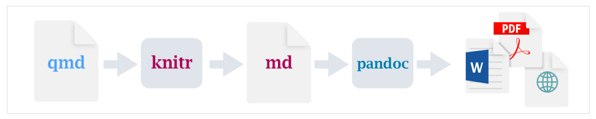

# Markdown语法

## 文本格式

*斜体*

**粗体**

~~删除线~~

`代码`

上标 ^2^

下标 ~2~

[下划线]{.underline}

## 链接和图像

<https://quarto.org/docs/get-started/hello/rstudio.html>

[Quarto官网](https://quarto.org/docs/get-started/hello/rstudio.html)



# 代码块

可以通过菜单栏Code-Insert Chunk来添加，也可以用快捷键Ctrl+Alt+I

```{r}
a <- 3+5
a
```

运行代码可以点击右边的▶按钮，也可以使用快捷键Ctrl+Shift+Enter

## 代码块选项

| 代码块选项 | 功能           |
|------------|----------------|
| label      | 添加代码块标签 |
|            |                |
|            |                |
|            |                |
|            |                |
|            |                |
|            |                |
|            |                |
|            |                |
|            |                |

: 代码块标签
